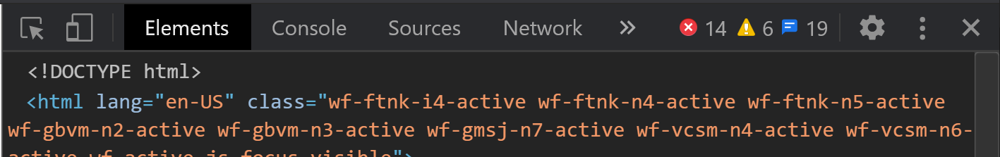
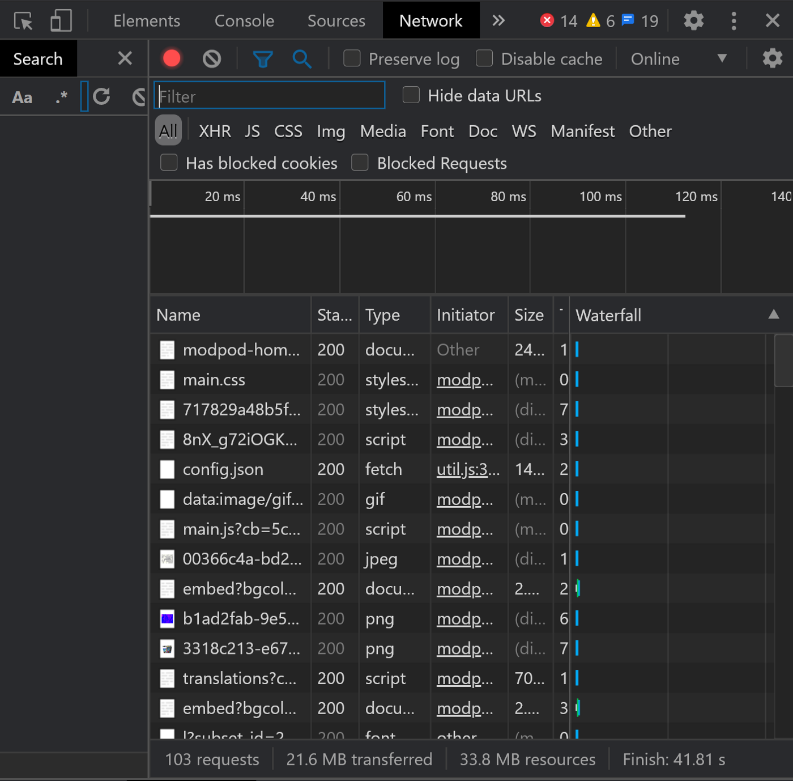
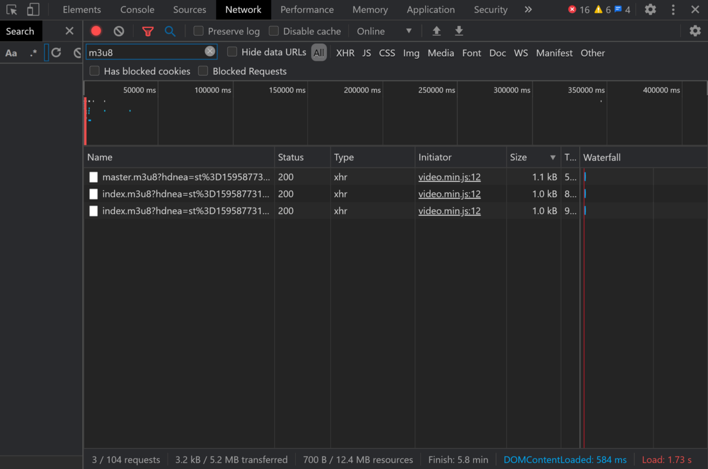
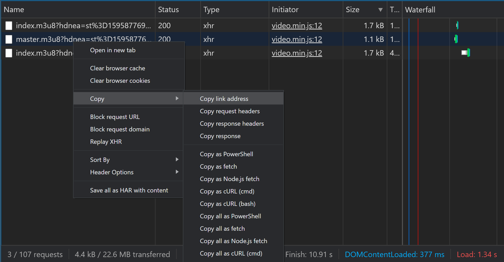
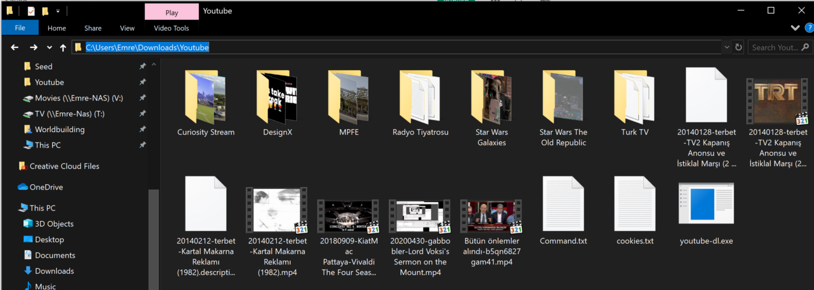
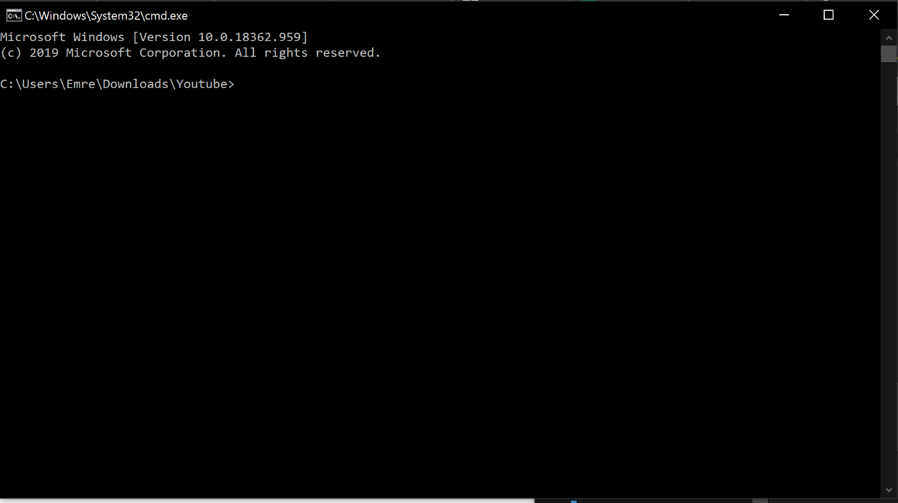
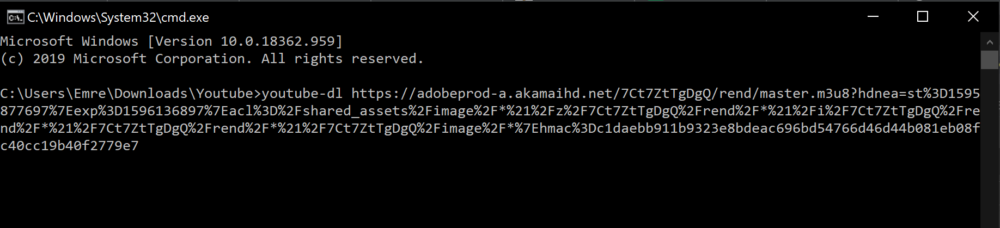
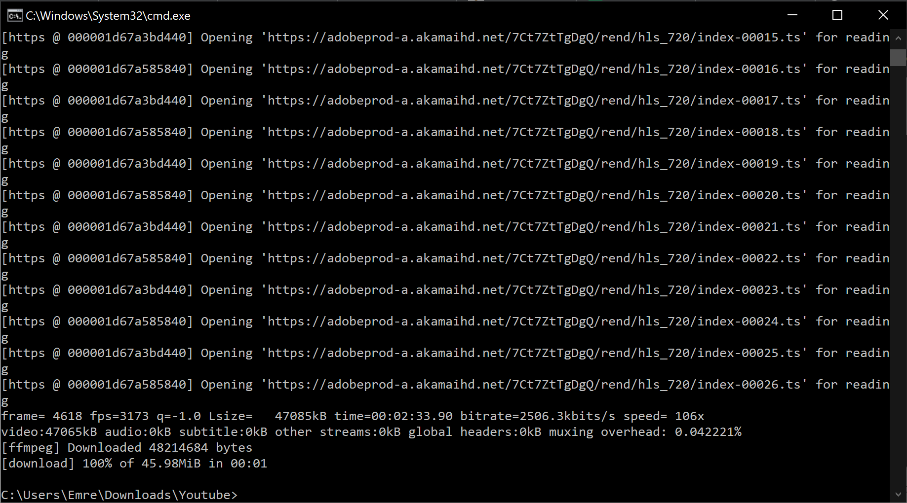
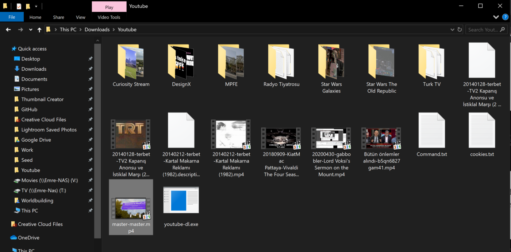

Lately, I’ve been witnessing subtle “defensive” design choices on the web more and more. In the last instance, I was switching my portfolio software from Adobe Portfolio to Webflow. _(You are currently on my new custom built Gatsby blog!)_ However, it has been years since I added my first project on Adobe Portfolio, so most of the original project files are nowhere to be found in my PC. So I thought “I have my videos already on Adobe Portfolio, I just need to right-click and download!”. Well, I couldn’t do it. Adobe Portfolio doesn’t have the option to download the video.

As a guy who loves a good challenge, I started to tinker. I tried the most popular Google Chrome extensions, didn’t work. The extensions work on 90% of the websites out there, it was just my bad luck that Adobe Portfolio was in the other 10%. Once I exhausted all my extension options, it was time to bring the big guns out…

## Download your video from Adobe Portfolio

### Step 0: You need these

To be able to do what I did, you need the following:

- A browser. [[Download](https://www.google.com/intl/en_ca/chrome/)](I used Google Chrome.)
- Youtube-DL [[Website](http://ytdl-org.github.io/youtube-dl/)](Don’t get intimidated, youtube-dl is an amazing script that you will definitely use in the future once you get used to it.)
- That’s it! (You may need to download [FFmpeg](https://ffmpeg.org/) if you haven’t, I’m not sure.)

### Step 1: Let’s find the source URL

Similar to big video platforms, Adobe Portfolio delivers the videos in chunks, “streams”.

- Open your browser and Adobe Portfolio page that has the video you want to download embedded.
- Right-click on the page. Click “Inspect”. The following screen will open on the right-hand side of the page or at the bottom.

- By default, Chrome opens the “Elements” tab. You need to click on the“Network” tab. Once you activate the “Network” tab, you will see the following.

- Okay, now go ahead and click on the play button of your video on your Adobe Portfolio page. You will see new files are being added to the downloaded files list in the Network tab.
- It may be difficult to see which files are related to the video that Adobe Portfolio just downloaded into your machine. That’s why we will filter the results by clicking on filter and entering “m3u8”.

- Right-click on the file name starting with “master.m3u8", click “Copy” and click on “Copy link address”.

- Now we have the master URL of the video. We can move to Step 2: Download the video with youtube-dl.

### Step 2: Download the video via youtube-dl

- Create a folder, my folder is called “Youtube”.
- Put the youtube-dl.exe you have downloaded from this link [http://ytdl-org.github.io/youtube-dl/download.html](http://ytdl-org.github.io/youtube-dl/download.html) inside the folder.
- Click on the directory path and write “cmd” and press enter. This will automatically open the Windows command line inside this folder. So you won’t have to write more commands than you need to.

You can see the folder path section selected. Write “cmd” and press enter.

After you press enter, this screen will open up.

- Now to download, we will write the following into the command line.

`youtube-dl THE_URL_YOU_HAVE_COPIED_THE_MASTER_M3U8_ONE`

It will look like this:

- Now just press enter and youtube-dl will start downloading your video into the folder you put the youtube-dl into. The video’s name will be “master-master.mp4"

Happy ditching Adobe Portfolio!
