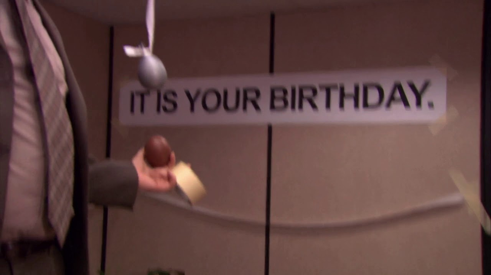
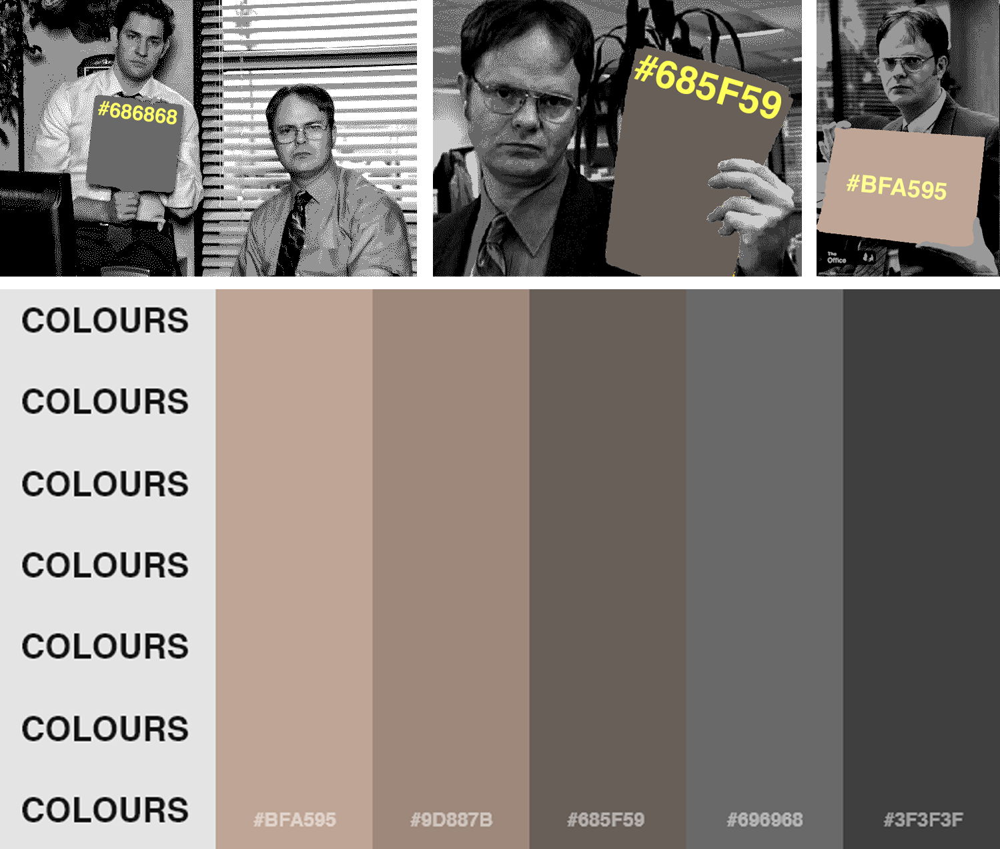
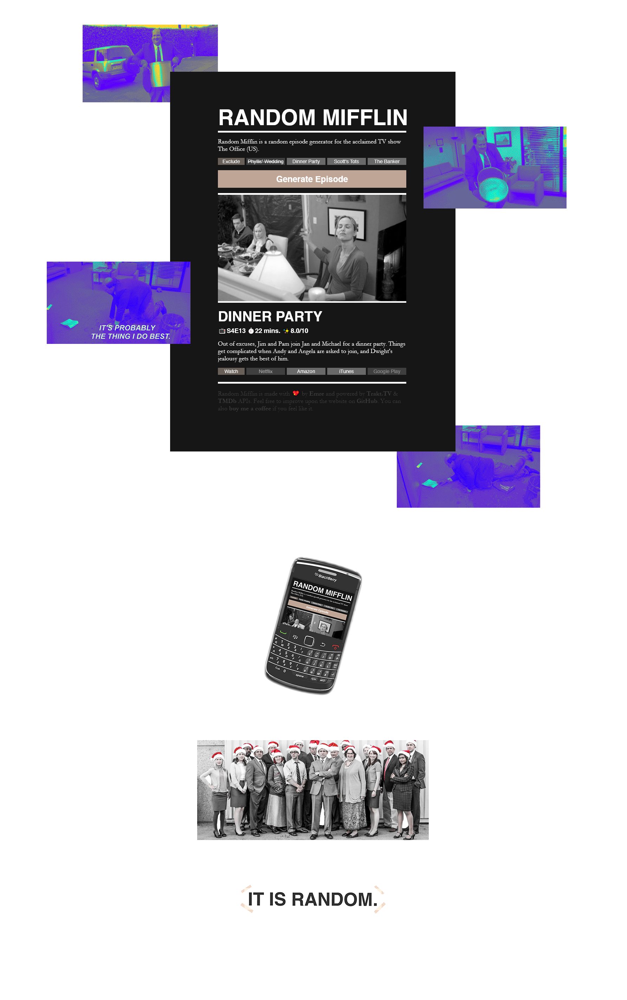

## Branding

### Style Inspiration

Before starting to laying out the wireframes and deciding on the branding, I decided to take a look at what makes The Office, The Office.

Office life, at least the one that can be observed in the show, is monotone, far from exciting, orderly and boring. The same thing, except the boring part, can be said for Dwight Schrute even though he is my favourite character.

So the screencap above, in my opinion, is the perfect representation of the big corporate life. A formal celebration of an employee's birthday. It also includes the belly of Dwight Schrute. His suit throughout the show is in muted colours and far from any risks. That is why I wanted to capture the mood and the colours of the screencap.

I've chosen Helvetica for titles and buttons. The reason for choosing Helvetica was its wide use in The Office and the corporate world. I wanted to pair the sans-serif Helvetica with a serif font. Times New Roman is the go-to corporate font for body text. However, I wanted to spice things up and bring a bit more elegance to the table by going with Garamond.

### The "Exclude Episodes" Button

There was 4 episodes I wanted users to be able to exclude from the pool: Scott's Tots, The Banker, Phyllis' Wedding, and the Dinner Party. The decision of where to put the button to exclude episodes was the most challenging part of the whole project in terms of experience design. Traditionally all filter/sorting buttons are shown after the user takes action. In Random Mifflin, this didn't feel right because the flow is different.

Caption: "A simple user flow".

Users would want to exclude an episode from the results before generating the results. Therefore I decided to put an exclude episode button with select episodes to choose from before the "Generate Episode" button.

In my low-fidelity wireframes, this was a basic filter button, however, later, during the high fidelity design I decided to get rid of the button and instead put the 4 episodes openly, before the "Generate Episode" button.

## Results

Finally, I connected all the dots I gathered from the branding and wireframing processes. I applied sharp corners and the dull color scheme to all shapes.

## Reflection

Before this project I wasn't feeling comfortable writing JavaScript. However, this project helped me gain confidence in that aspect. It also made me acquainted with object oriented programming methodologies and made me hungry to learn more.
