## Summary

Cya Live is an early-stage startup located in downtown Toronto. Its MVP can be summarized as "Watch movies with friends." However, the product road map was updated every day to attract more investment and not lose the existing user base. So the focus of the design team changed on a daily basis. And since my time was limited to 120 hours I worked on multiple aspects/features of the product.

When I started, our clients were able to create events and sell tickets to those events. An event would consist of hosts (usually celebrities) that host the event, a moderator (almost like a stage manager) editing the feed/moderating the live chat, the viewers and content (can be a movie, a gameplay video from YouTube, and so on).

I was informed that because of the tight production schedule, the company was not able to  include UX into their process so they were excited to have me. This meant that I was the only person responsible for user experience design, the other designer was a generalist, handling every aspect including the interface design.

## Research

### Target Audience

After I felt comfortable in my knowledge of the vision and the existing product, I created 8 personas representing the wide variety of user types that are expected to utilize Cya Live.

Besides helping me flesh out and understand the product better, these personas will help me prepare the user flows.

Gallery
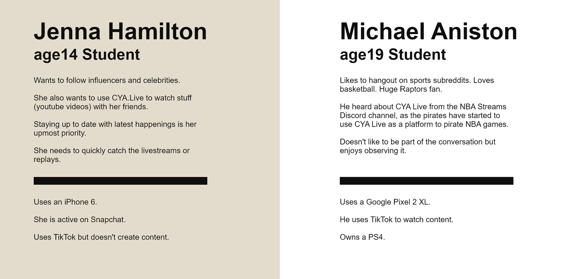
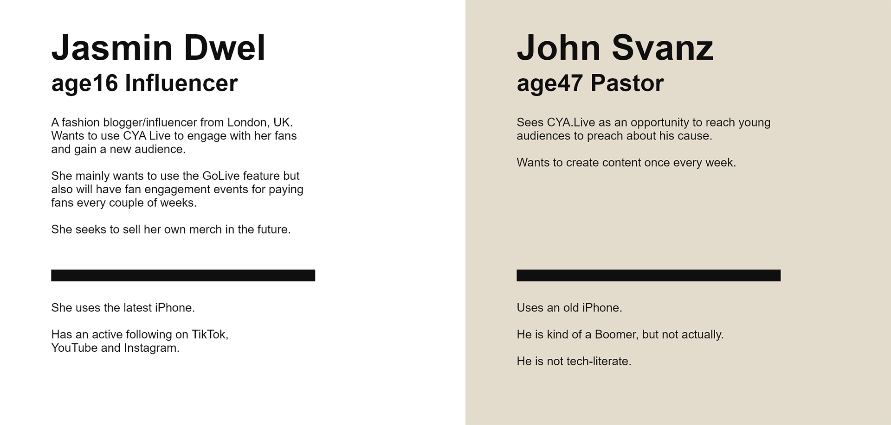
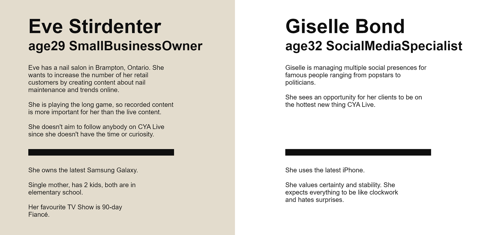
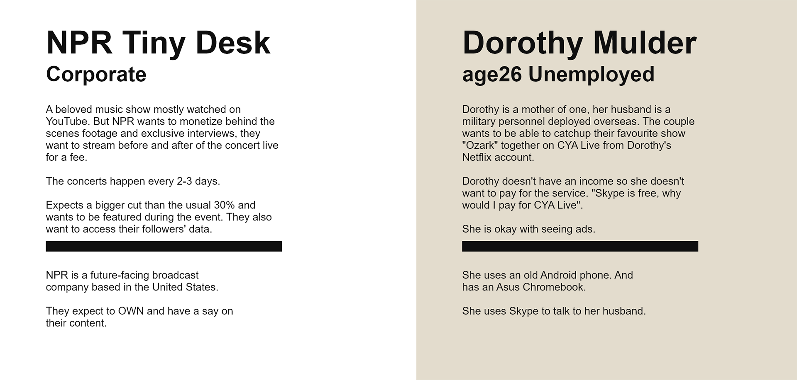

### EVALUATING AND UNDERSTANDING THE CURRENT PRODUCT

During my job interview and the first couple of days of my internship, I reviewed the existing product and reported my findings to the developer team. I did my review according to the 10 Usability Heuristics by Jakob Nielsen, I also used the general best practices I have learned through my previous works and education.

Gallery
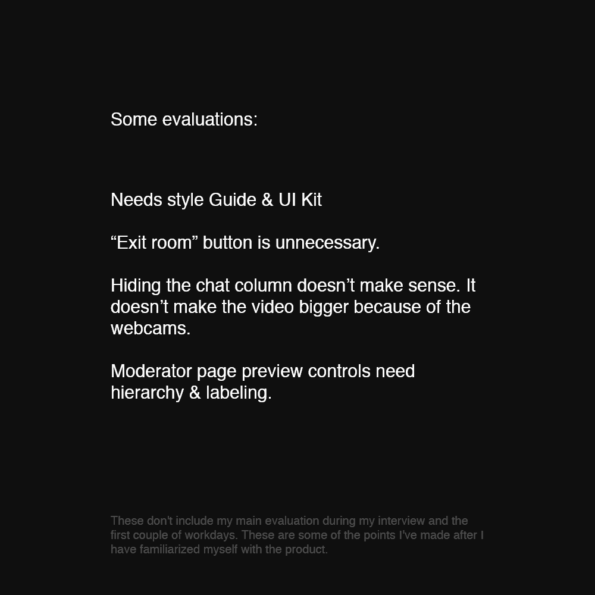
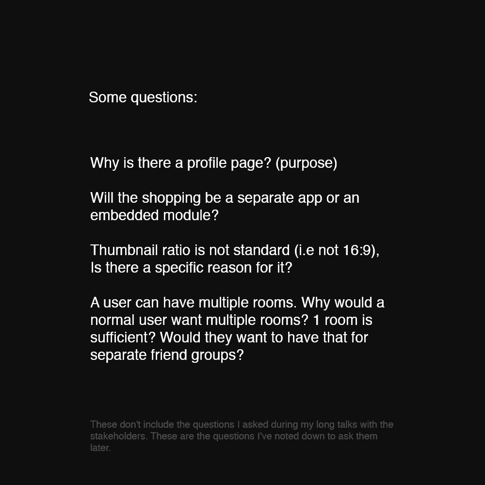

Before putting anything on top of the app, I first needed to know more about it.  During this process I asked a bunch of questions including a lot of "Why?"s, "How"s and "Who"s.  After I got a grasp of the product, I decided to start with creating personas.

### Defending the users

During a talk with the COO, the idea of adding a credit system and accepting payment from the users exclusively through that system emerged. As an experience designer, I notified them that:

- There is no fixed event pricing. So users will always pay more than they need.
- Most people will come to the website for a single event, to watch movies with friends. Again, users will have to pay more than they need to pay.
- Episodic events like weekly discussion shows are already handling the payment through Patreon via monthly subscription fees.

This experience made me understand better how user interest is not always mutually exclusive with the business interest.

### User Flows

Gallery

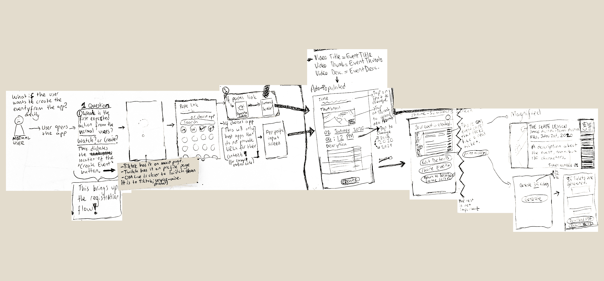
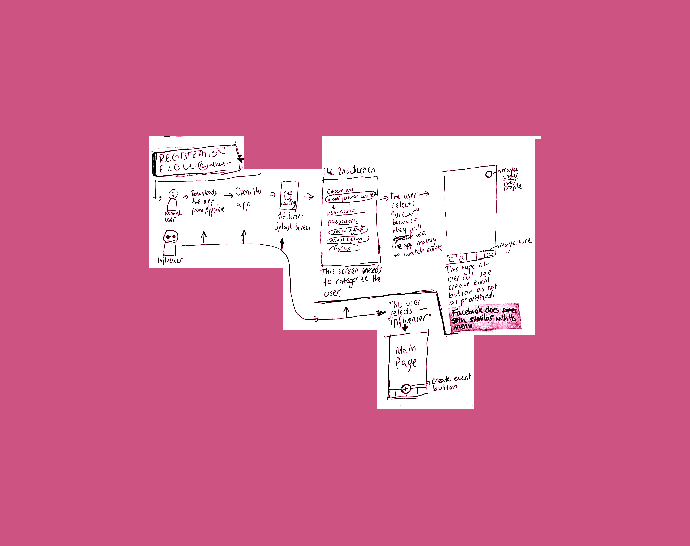

## Design

### Wireframes

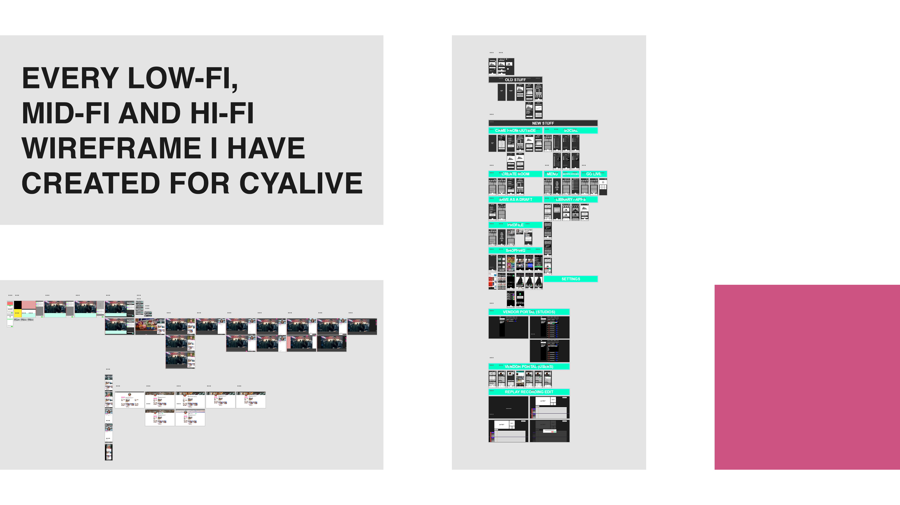

### Low Fidelity Video Upload Module

Gallery
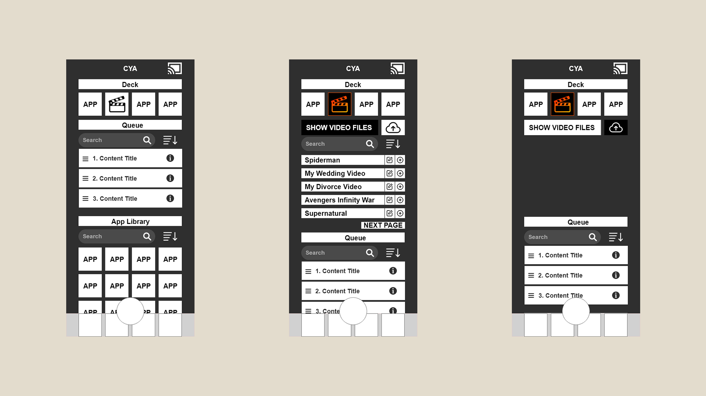
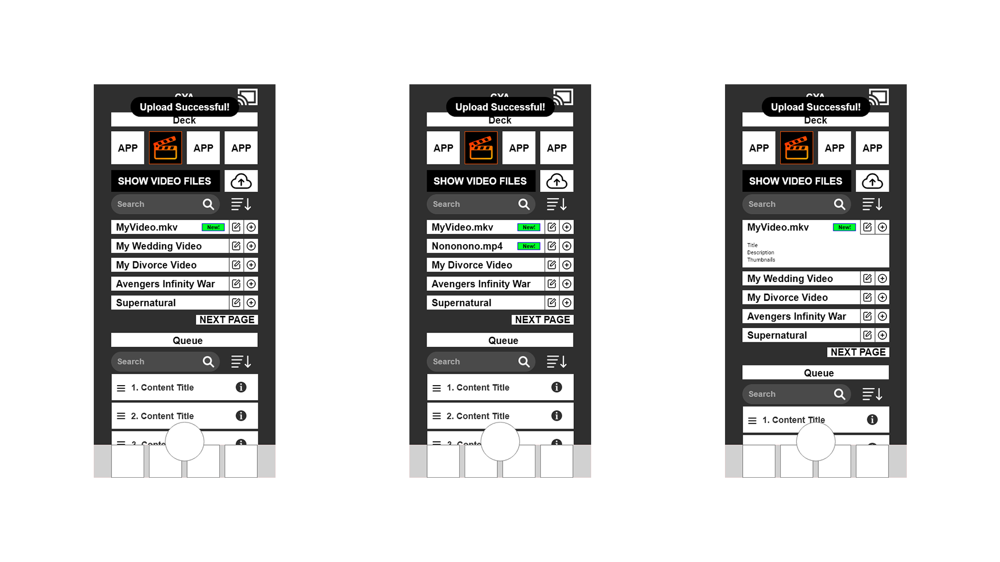

### Reflection

The big keyword during my field placement was "adaptation". By the end of my placement, I:

- Learned how to thrive in fast-changing, high-pressure environments.
- Learned how to break/change my design process to adapt to tight-schedules and expectations.
- Improved my interdisciplinary communication skills, since I had a lot of  talks with the development team, COO and the CEO of the company.
- Familiarized myself with startup culture, and observed the differences between corporate and startup cultures.

I also got a good grasp of mobile typography, hierarchy and sizes thanks to numerous wireframe designs and competitor benchmarks.

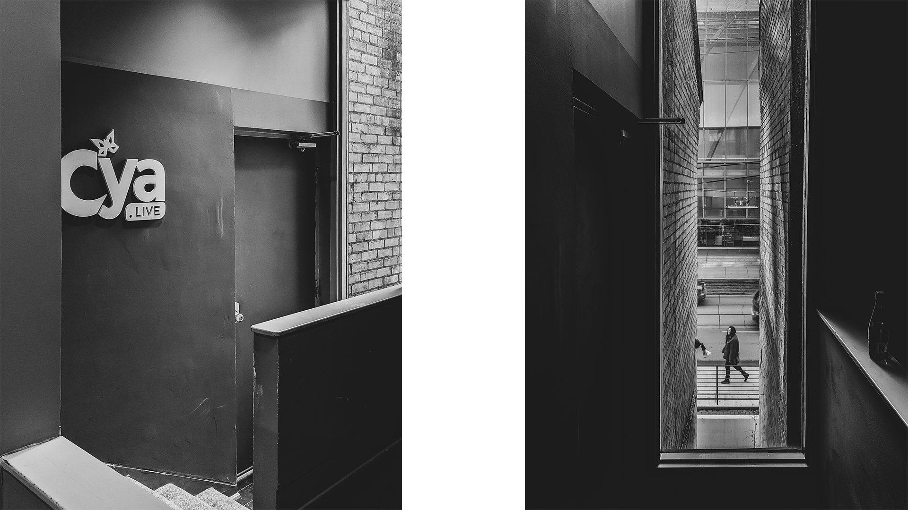
Caption: "Our office was right across the Art Gallery of Ontario. This was the perfect excuse for me to visit the AGO more than enough times."
