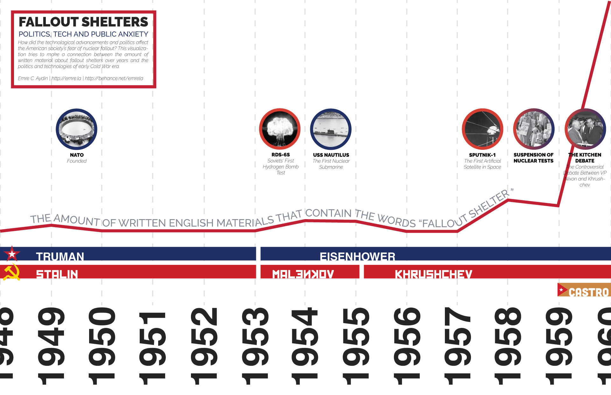

I was asked to design an interactive data visualization at school.

My data visualization is exploring the relationship between politics, technology and fallout shelters. We can summarize it by saying "public anxiety on nuclear threats".

For this project, the most efficient data visualization method was the Pareto Chart. Therefore, I used that as the base of my visualization. Besides this, I utilized a dot-plot-style news composition to bring more depth for the user.

I have incorporated elements like color, hierarchy and icons in my visualization to keep the text amount at a minimum.

The biggest challenge was coming up with the composition and the colors of the "Presidents" page.

## PRELIMINARY DATA VISUALIZATION

The preliminary phase of the visualization was done for another class, that class's focus was on the research part so my visualization for it emphasized the content and wasn't as visually appealing as the final data visualization.

During this phase one of the main challenges was to answer the question "How can I create and visualize a relationship between 3 different data sources?" and another one was to give enough information to the viewers for them to understand what is going on but at the same time give them enough space to come up with their own conclusions.

## THE DESIGN OVERHAUL

I started my workflow by doing some sketches on Illustrator, I normally do it with pen and paper, however, couldn't resist Illustrator this time. I created 2 different concepts. After some thinking, I decided to go with the one on the left because it was the better way to explore a development and cause visualization.

After deciding on the concept I created the main page. I wanted to go with lively colors to make the visualization more interesting. Used blue to represent USA and red to represent USSR and its allies. To represent the both worlds I went with purple, the mix of red and blue. And this color choice created the first challenge. The challenge of choosing a color to represent the Google nGram data. Whatever color I tried, there weren't enough contrast so after some trial and error I went with green.

It is time for creating the news page. The news' main political actor is presented on the left side with a bigger visual. While the opposite party represented with a smaller photograph. Also, to make their political sides obvious, I used the same color I've used for the countries/blocks. I also used the main actor's customized country flag in the background. USA's flag is fine, however, USSR flag proved to be a challenging one due to the lack of detail on the whole surface of the flag. So I had a little space to show that it is the USSR's flag.

Finally, I created the "President" page. This page challenged me in numerous ways. It wasn't easy to create a hierarchy with the color palette. I also wished that Adobe XD had tools to justify the text, but no luck. However, I'm happy with the final result.

