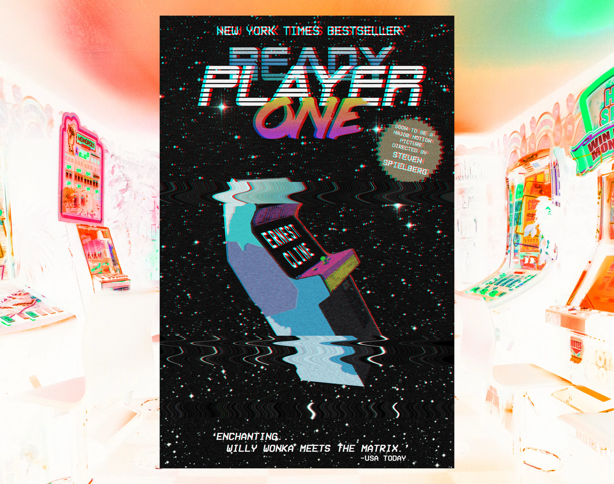
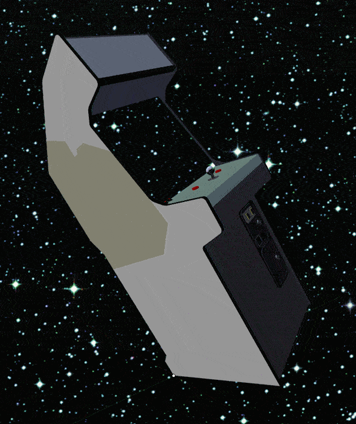
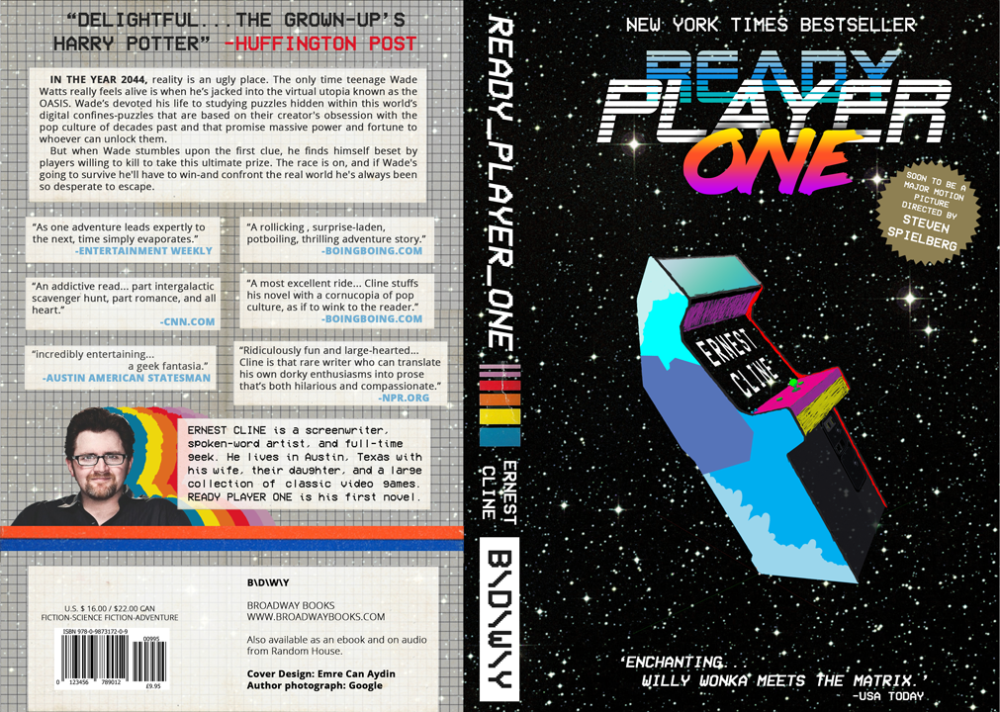
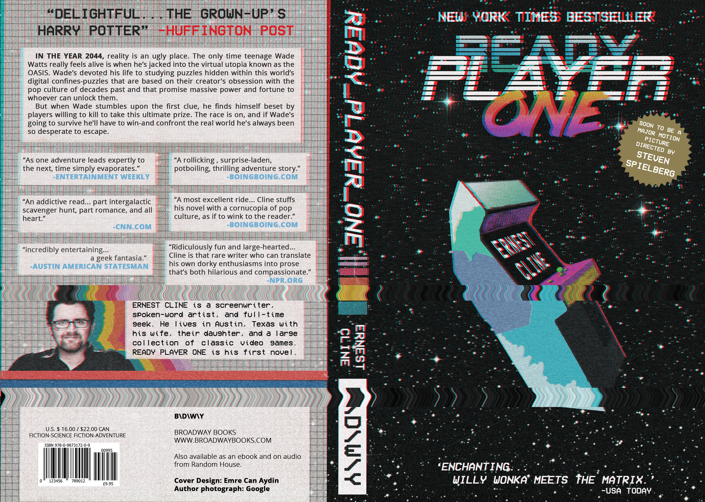
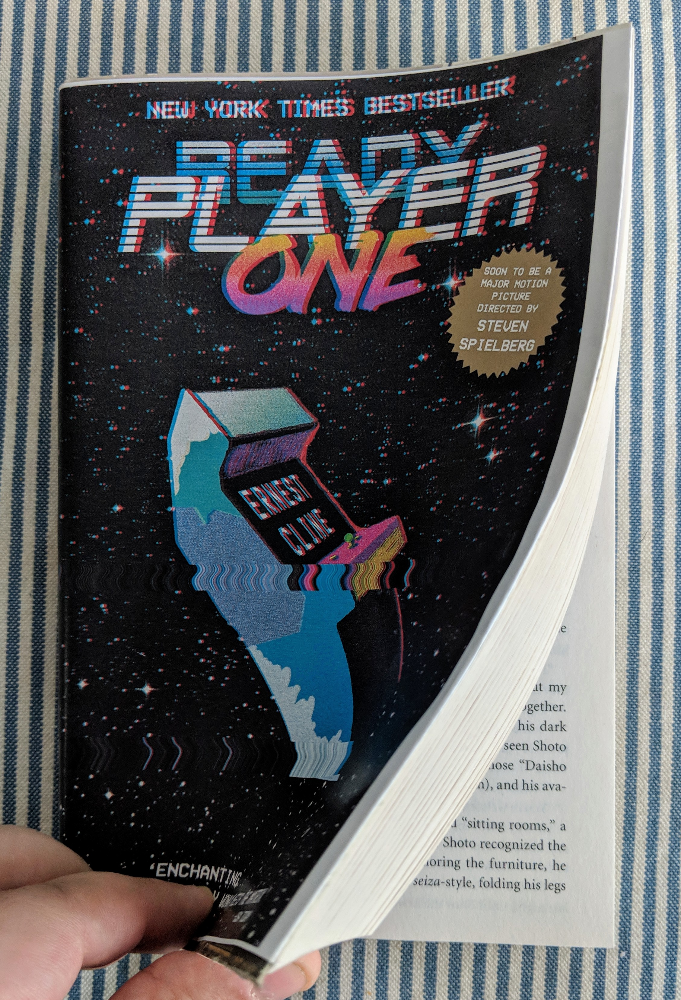

In Humber College's Design Foundation program, I was asked to create a book cover for my book of choice. At that time (early 2017) I was really into Ernest Cline's awesome book Ready Player One. The book is about a dystopian future with tons of 80s references.

First, I did my research and found some typefaces that I think would mirror the book's heart and soul. After this, I gathered a couple of book-specific fan-art and finally some awesome art about cyberpunk and the future. I purposed them to act as a mood board of some sorts.

The first challenge was the fact that I am not the best artist when it comes to drawing realistically. So I have found a 3D model of an arcade cabinet under Creative Commons license and changed its perspective in Blender. After, I colored it by hand in Photoshop.

After I prepared the cabinet and the whole book cover, the time has come for the back cover. Because of the project's requirements, I had to keep every single text that was already in the book's cover which was pretty challenging to do so due to the sheer amount of reviews the book had on its back cover. So, the color choice, the text size, typography, in general, was challenging to overcome. Color-wise, I was able to make a sound design choice by choosing my colors from old VHS tapes' branding colors for both the back cover and the side of the book.

Finally, I applied a VHS effect that I created in Photoshop to my design. When I brought my design to the school for critique, our professor told me that it would be better if I could change the text with Steven Spielberg because it was difficult to read.

